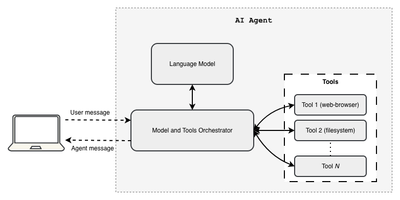
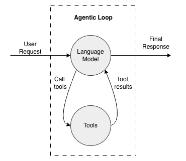

# AI Agent 101: Let's Talk About Robots 🤖

So, you've heard people throwing around the term "AI agent" for just about anything, right? 🎉 Some folks call the language model itself an agent. Others call anything with a model API wrapper an agent. But here's what an AI agent actually is: **it's a software program that uses a language model plus tools to make decisions and take actions (like searching the web, managing files, or calling external APIs) to achieve goals based on your instructions**.

Think of it this way: 

- The **language model** is like the brain 🧠 — it thinks and makes decisions
- The **tools** are like the hands 🛠️ — they actually do the work
- The **agent** is the whole system that connects the brain to the hands and gets things done!

In software terms: the language model provides the reasoning, the tools provide the actions, and the agent orchestrates everything together.



At its core, an AI agent uses a language model's superpower — generating text tokens — as its decision-making engine. Then it calls upon tools (which are just code-functions, nothing fancy!) to actually *do* the thing. Quick refresher for those in the back: a language model predicts what word (or "token") comes next in a sequence. Companies like OpenAI, Google, AWS, Anthropic, and others give us APIs to send prompts and get generated response back. An agent? That's the clever program that ties model calls together with tool invocations and keeps track of what's happening between them.

Let's break down how we turn a token-spitting model into an autonomous agent that actually gets work done! 💪

## What Even Is a "Tool" in Developer Speak? 🔧

Relax — a tool is just a fancy word for a **code function with structured inputs and outputs**. That's it! No mystery here.

Check out these two Python functions below. They're basically wrappers around third-party API calls (aka, they make the real magic happen elsewhere):

```python
def get_temperature(city: str):
    """Return the current temperature of a city."""
    temperature = call_third_party_api_for_temperature(city)
    return {"temperature": temperature}

def get_total_area(city: str):
    """Return the geographical area of a city."""
    area = call_third_party_api_for_area(city)
    return {"area": area}
```

See? Just functions. Nothing to be scared of! 😊

## How Agents Actually Use Tools (The Secret Sauce) 🍝

Alright, here's where it gets fun! When you send a prompt to an agent, the agent doesn't just pass it straight to the model like some lazy middleman. Nope! It constructs a **super-prompt** by combining your message with additional context — like the agent's purpose and descriptions of all the tools it has available. This extra context usually shows up as a system prompt (plus structured function definitions for the model to understand).

The model input gets built *at runtime* using your message plus all the stuff the agent's program prescribes. Here's what that looks like in our example:

```
Model input: {
    "messages": [
        {
            "type": "system_prompt",
            "text": "Your are helpful AI assistant that answer user queries using the data provided by available tools."
        },
        {
            "type": "human_prompt",
            "text": "What is the temperature of New York?"
        }
    ],
    "tool_specifications": [
        {
            "name": "get_temperature",
            "description": "Provides the current temperature of a city",
            "input_schema": {
                "city": {"type": "string", "description": "The name of the city"}
            }
        },
        {
            {
                "tool_name": "get_total_area",
                "description": "Provides the geographical area of a city",
                "input_schema": {
                    "city": {"type": "string", "description": "The name of the city"}
                }
            }
        }
    ]
}
```

Each tool definition gets mapped to its corresponding code function in the agent's software program. When the model receives this input, it thinks (well, "predicts") and decides, "Aha! I should call `get_temperature`!" and spits out something like this:

```
Model output: {
    "messages": [
        {
            "type": "tool_call",
            "tool_name": "get_temperature",
            "arguments": { "city": "New York" }
        }
    ]
}
```

Now here's where the agent program earns its paycheck! 💼 It looks at the model's output, spots the "tool_call" message type, parses that JSON, and executes the actual code function mapped to `get_temperature`. Let's say that function returns:

```
code-function output: {
    "temperature": "12 °F"
}
```

Brrr! 🥶 Cold in New York!

But wait, there's more! The agent doesn't stop here. It calls the model *again*, this time with the full conversation history PLUS the tool result. Check it out:

```
Model input: {
    "messages": [
        {
            "type": "system_prompt",
            "text": "Your are helpful AI assistant that answer user queries using the data provided by available tools."
        },
        {
            "type": "human_prompt",
            "text": "What is the temperature of New York?"
        },
        {
            "type": "tool_result",
            "output": { "temperature": "12 °F" }
        }
    ],
    "tool_specifications": [
        {
            "name": "get_temperature",
            "description": "Provides the current temperature of a city",
            "input_schema": {
                "city": {"type": "string", "description": "The name of the city"}
            }
        },
        {
            {
                "tool_name": "get_total_area",
                "description": "Provides the geographical area of a city",
                "input_schema": {
                    "city": {"type": "string", "description": "The name of the city"}
                }
            }
        }
    ]
}
```

The model analyzes everything and produces a nice, human-friendly answer:

```
{
    "messages": [
        {
            "type": "ai_prompt",
            "text": "The current temperature of New York is 12 °F."
        }
    ]
}
```

Ta-da! 🎊 But if the model had requested *another* tool call, the agent would continue the loop: parse `tool_call` message json → execute code-functions → return tool results → call the model again. The loop continues until the model returns an output that does not request any more tool calls.

## It's All Just a Loop, Baby! 🔁

Conceptually, an agent is basically running this loop over and over:

1. **Build the model input**: system context + conversation history + available tools
2. **Call the model** (and cross your fingers 🤞)
3. **If the model asks for a tool**, parse it and execute that bad boy
4. **Append the tool results** to the history and jump back to step 2
5. **If the model gives a final answer** (no more tool calls), return it to the user and call it a day! ☀️



This loop is why we say an agent is **a program that orchestrates a language model with tool-calling code functions**. The model brings the brains 🧠; the program brings the brawn 💪 and keeps everything organized between model calls and tool executions.

## Real-World Gotchas (Because Nothing's Perfect) ⚠️

Let's keep it real for a sec:

* **Function-calling APIs are your friend**: Many modern APIs support structured tool definitions (function-calling), which is way safer and more robust than hoping the model spits out perfectly formatted text tags. These APIs let the model return structured function calls that you can parse without crying. 😅

* **Context windows have limits**: Preserving *all* conversation history on every loop sounds great in theory, but you'll eventually hit token limits. Real agents use tricks like summarization, memory stores, or retrieval-augmented context to keep things relevant without exploding the context window. 

* **JSON parsing can be... temperamental**: Models sometimes emit wonky JSON. Function-calling APIs and schema validation are lifesavers here! 🛟

* **Never trust blindly**: Always validate tool inputs and outputs. Don't assume the model will generate safe or correct parameters — validate, validate, validate!

* **Tool design matters**: Well-defined, narrow tools reduce ambiguity and make your agent's behavior predictable. Keep it simple, smartie! 🎯

## The Ecosystem (AKA: You Don't Have to Build This from Scratch!) 🌍

Software frameworks like **LangChain**, **Strands**, and Google's **ADK (Agent Development Kit)** provide patterns for building agents. They all follow the same basic idea we just covered: give the model tool specs, let it decide what to call, execute the tool in your program, feed back the results, and iterate until you're done. 

Why reinvent the wheel when smart people have already built really nice wheels? 🎡

## The Fancy Stuff: Tool Learning, Coding Agents, and Memory 🚀

Here's where things get *really* interesting! Model providers and researchers have made HUGE progress in teaching modern language models how to understand and use external tools. This is especially visible in **coding agents** — which have become some of the most popular AI agent applications because, well, developers love automation! 👨‍💻👩‍💻

Coding agents are particularly badass at executing shell commands and managing files across simple to insanely complex repository structures. They can navigate multi-file projects like a pro and handle CLI-style development tasks with ease.

And here's the kicker 💡: AI developers are now **harnessing** this file operation capability to build **memory systems** for agents! 🧠💾 Information gets stored and retrieved from files for both short-term and long-term use. This file-based memory is also crucial for **context engineering** — helping agents maintain relevant knowledge across multi-turn conversations without blowing up the context limits.

Pretty clever, right? 😎

## TL;DR (The Summary You've Been Waiting For) 📝

* An **agent is NOT the model** — it's the software that *uses* the model plus tools to act autonomously
* The model is the reasoning engine; tools are the code/APIs that actually do the work
* The typical pattern is a loop: model suggests tools → program executes tools → results feed back → repeat until done ✅
* Real agent engineering requires careful tool design, input/output validation, context management, and being ready for when the model does something weird

This whole "wrapping a model API with tool invocation loops" thing is what transforms language models from impressive token generators into autonomous executors of real software tasks. It's the plumbing that turns natural-language instructions ("Get me the weather!") into concrete actions (actually calling a weather API and returning the result).

And that, my friend, is how the magic happens! ✨

---

*PS - Now go forth and build some agents! And remember: with great AI power comes great responsibility.  Happy coding!* 🎉🚀

---

> **Want updates on new posts?** Join my WhatsApp! 🎉 **[Group](https://chat.whatsapp.com/DleCJqi9JJ4A5i38O2vbUl?mode=gi_t)** for discussions and ideas, or **[Channel](https://whatsapp.com/channel/0029VbCa2R0EAKWCLAfPrz04)** for quiet updates. No spam, just cool content! 📢

---
